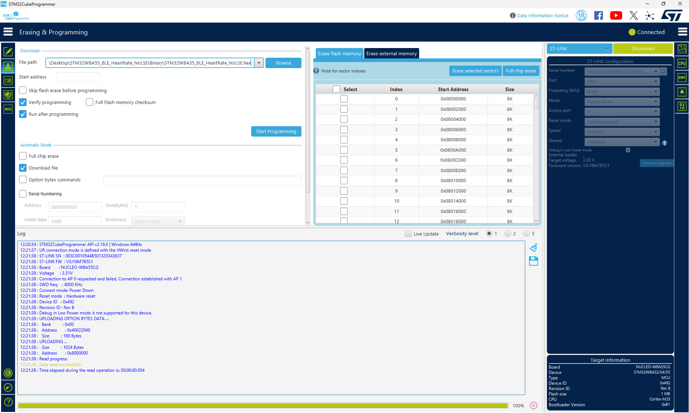
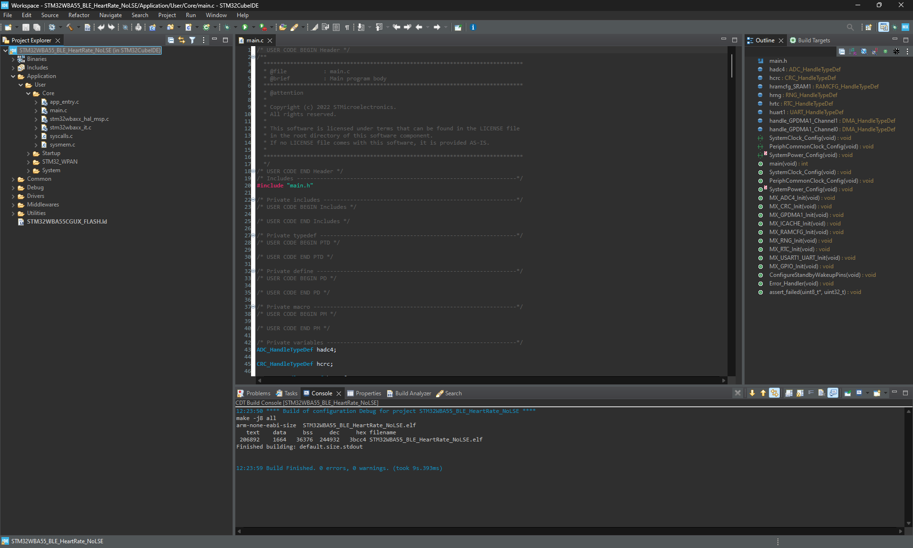
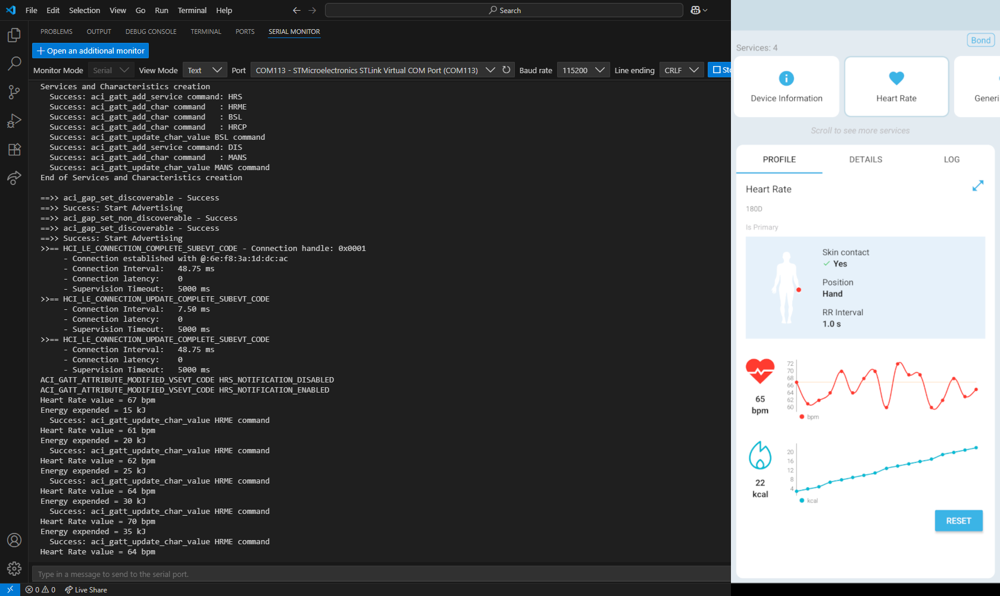
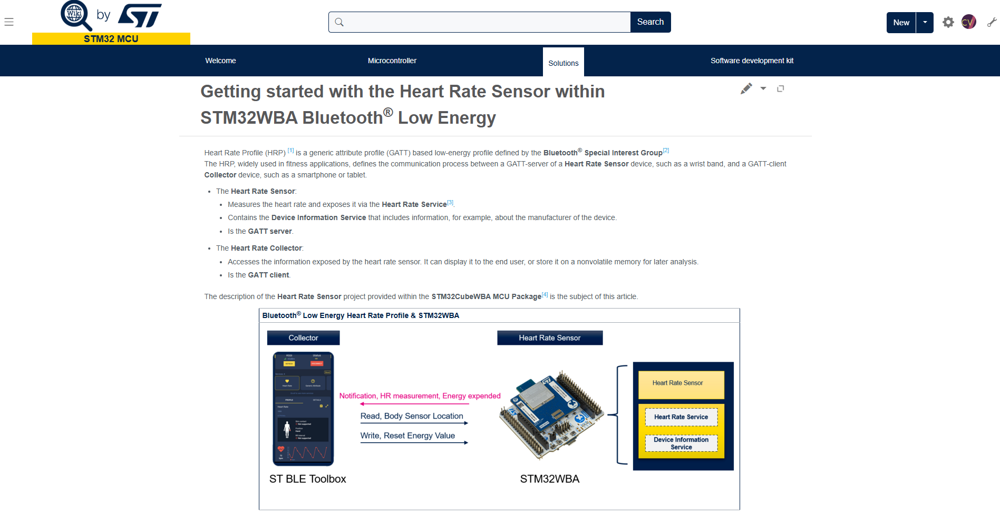
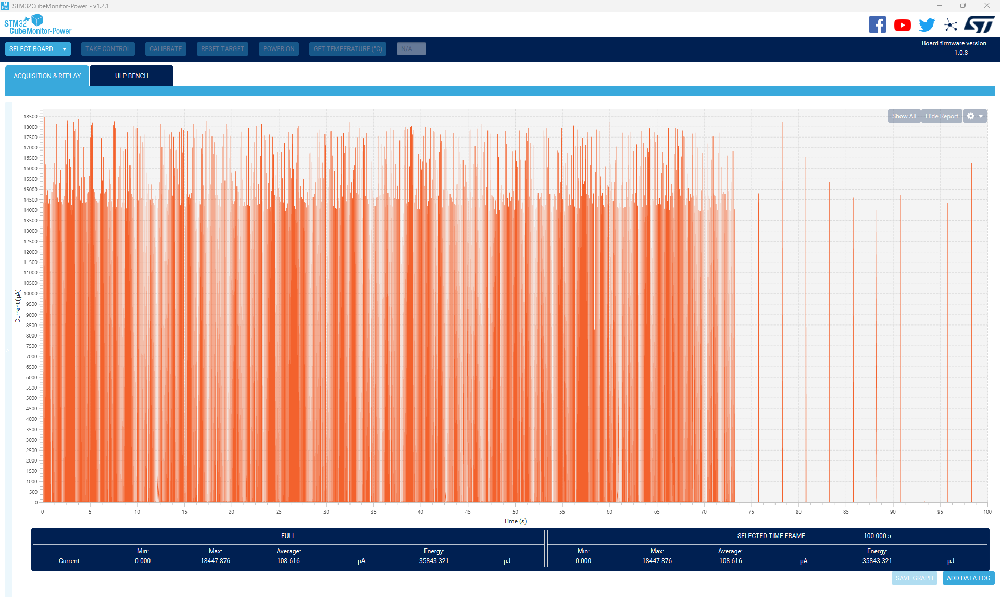
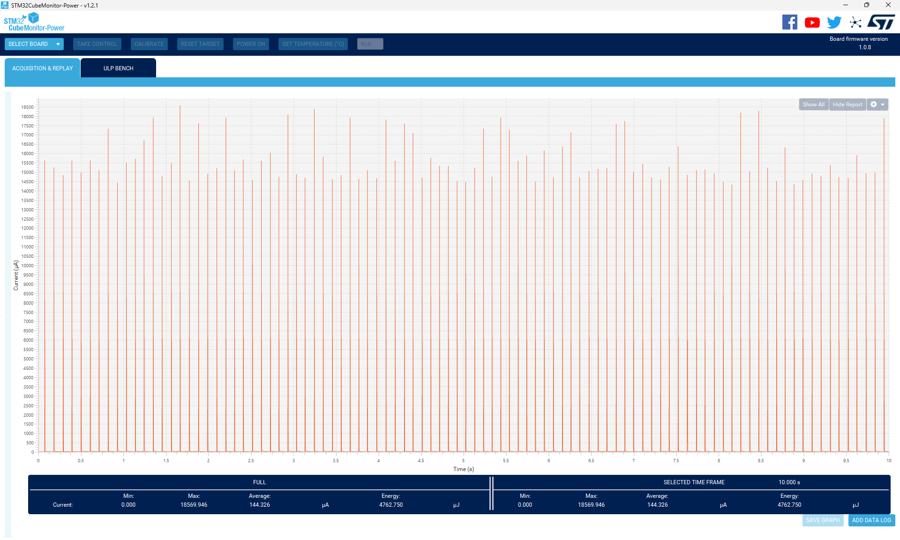
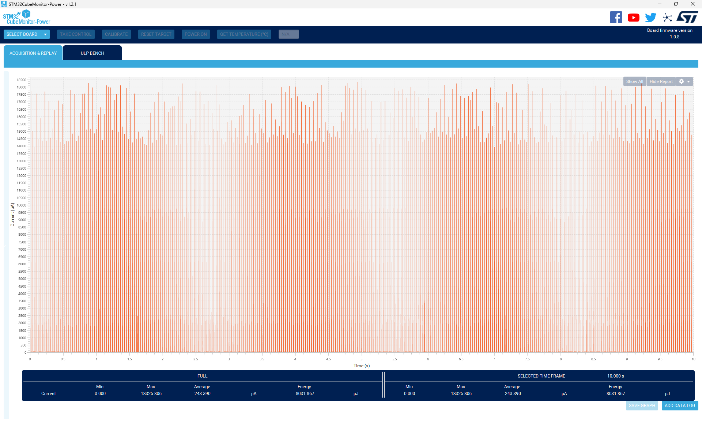
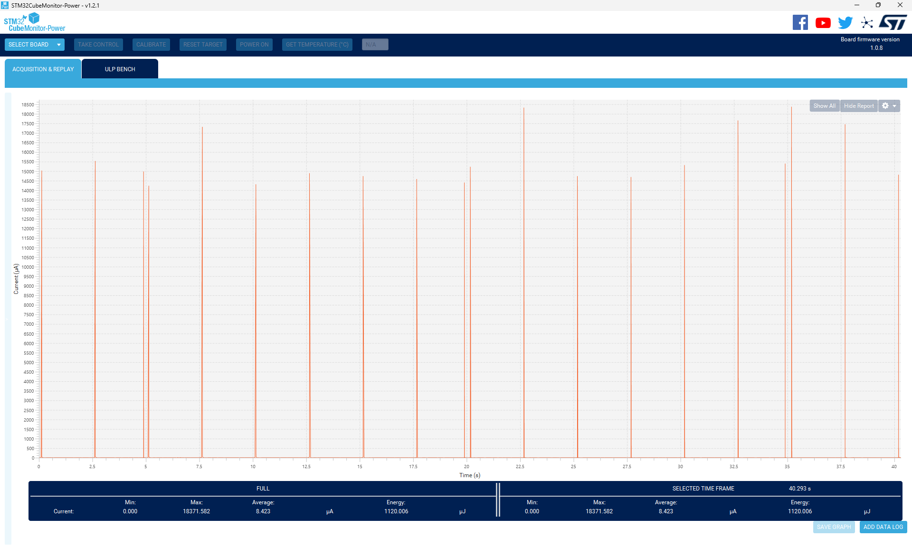
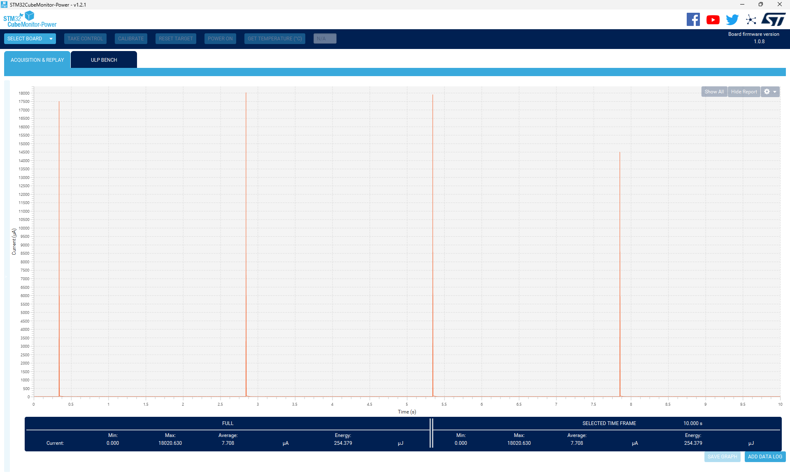

# STM32WBA55_BLE_HeartRate_NoLSE

**Author** : [Claudio Vertemara](https://github.com/ClaudioVertemara)

* The STM32WBA55_BLE_HeartRate_NoLSE is based on the [BLE_HeartRate](https://github.com/STMicroelectronics/STM32CubeWBA/tree/main/Projects/NUCLEO-WBA55CG/Applications/BLE/BLE_HeartRate) application from [STM32CubeWBA](https://www.st.com/en/embedded-software/stm32cubewba.html]) V1.7.0.
* This application is an example that demonstrates how to run an RF application on the STM32WBA without the LSE crystal.
* Check this [Wiki page](https://wiki.st.com/stm32mcu/wiki/Connectivity:STM32WBA_without_LSE_crystal) for how to configure a RF application on the STM32WBA without the LSE crystal.

## Hardware Needed

  * One [NUCLEO-WBA55CG](https://www.st.com/en/evaluation-tools/nucleo-wba55cg.html)

  * One smartphone or BLE Client device (Optional)

## Software Needed

  * Prebuilt firmware image: STM32WBA55_BLE_HeartRate_NoLSE.hex (STM32WBA55_BLE_HeartRate_NoLSE\Binary)

  * [STM32CubeProgrammer](https://www.st.com/en/development-tools/stm32cubeprog.html)

  * IDE (Optional)

    * [STM32CubeIDE](https://www.st.com/en/development-tools/stm32cubeide.html)

    * [IAR EWARM](https://www.iar.com/products/architectures/arm/iar-embedded-workbench-for-arm/)

    * [Keil MDK-ARM](https://developer.arm.com/Tools%20and%20Software/Keil%20MDK)

  * BLE Client firmware such as the [BLE Toolbox](https://www.st.com/en/embedded-software/stbletoolbox.html) app if using a smartphone (Optional)

## User's Guide

1) Flash the NUCLEO-WBA55 with the application using one of the following methods:

    a) Flash the prebuilt firmware image with STM32CubeProgrammer.

    

    b) Build and debug the application with an IDE.

    

2) Connect to the device using a BLE Client such as a smartphone.
    
    > Note: CFG_LOG_SUPPORTED, CFG_LPM_LEVEL, & CFG_LPM_STDBY_SUPPORTED in app_conf.h will need to be modified to see the logs via a serial terminal program.

  

3) Follow this [Wiki Page](https://wiki.st.com/stm32mcu/wiki/Connectivity:STM32WBA_HeartRate) for further information on the STM32WBA BLE_HeartRate application.

  

## Power Consumption

* STM32CubeMonitor-Power power consumption measurement files can be found under [Utilities/CMPM](Utilities/CMPM).
* Please note that CubeIDE was used for all power consumption measurements.

- Fast & Slow Advertising

  

- Fast Advertising

  

- Notification

  

- Slow Advertising

  

- Slow Advetising & Calibration

  

## Troubleshooting

**Caution** : Issues and the pull-requests are **not supported** to submit problems or suggestions related to the software delivered in this repository. The STM32WBA55_BLE_HeartRate_NoLSE example is being delivered as-is, and not necessarily supported by ST.

**For any other question** related to the product, the hardware performance or characteristics, the tools, the environment, you can submit it to the **ST Community** on the STM32 MCUs related [page](https://community.st.com/s/topic/0TO0X000000BSqSWAW/stm32-mcus).